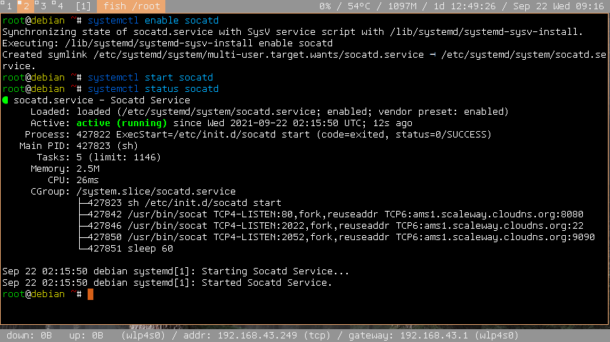

# Socat Daemon
A simple [socat](http://www.dest-unreach.org/socat/) daemon script for both `sysvinit` and `systemd`. Supports multiple socat commands and will automatically restart if some are killed for some reason. It is here for convenience in development. Should not be used in production especially with high concurrency.

## Directory Structure
<pre>
/
└── etc
    ├── init.d
    │   └── <a href="etc/init.d/socatd">socatd</a>
    ├── <a href="etc/socatd.conf">socatd.conf</a>
    └── systemd
        └── system
            └── <a href="etc/systemd/system/socatd.service">socatd.service</a>
</pre>

## Installation
Just place the directory structure into your system. Don't forget to make sure that the [/etc/init.d/socatd](etc/init.d/socatd) file is executable:
```
chmod +x /etc/init.d/socatd
```

## Usage
### Configuration
The configuration file is in [/etc/socatd.conf](etc/socatd.conf). It should contain a list of the socat commands you need. Not familiar with socat? The following article is easy to follow https://www.redhat.com/sysadmin/getting-started-socat.
### Linux with systemd
After everything is installed, please enable it with:
```
# systemctl enable socatd.service
```
Then:
```
# systemctl start socatd.service
```
to start.
### Linux with sysvinit
```
# /etc/init.d/socatd start
```
### View the logs
```
$ cat /var/log/socatd.log
```
## Screenshot

